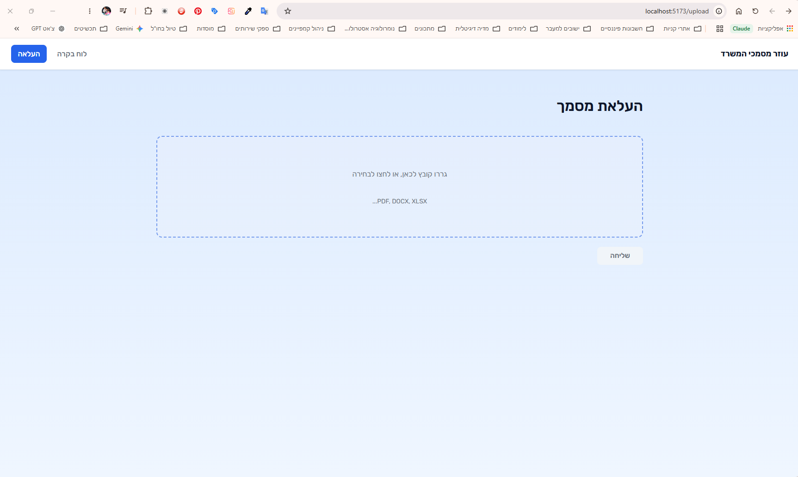
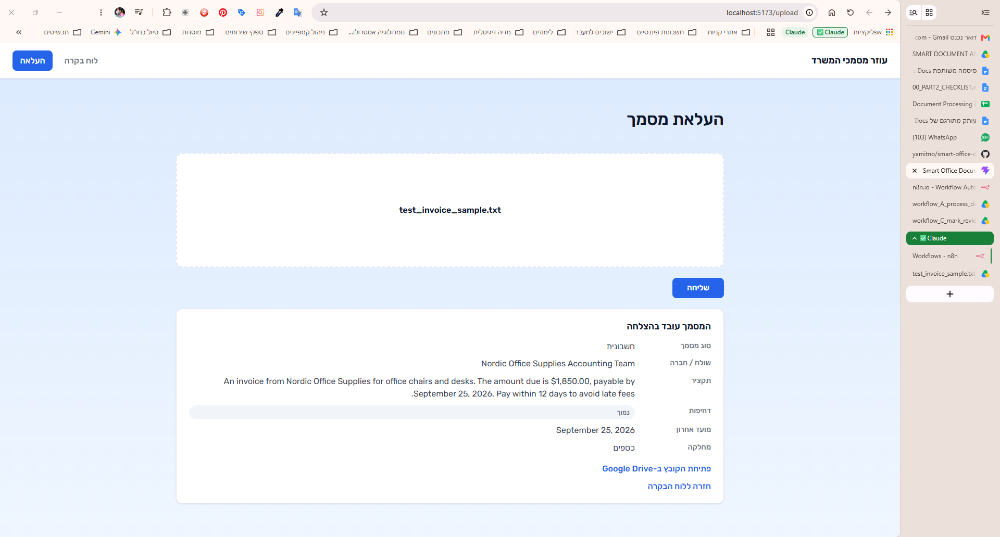
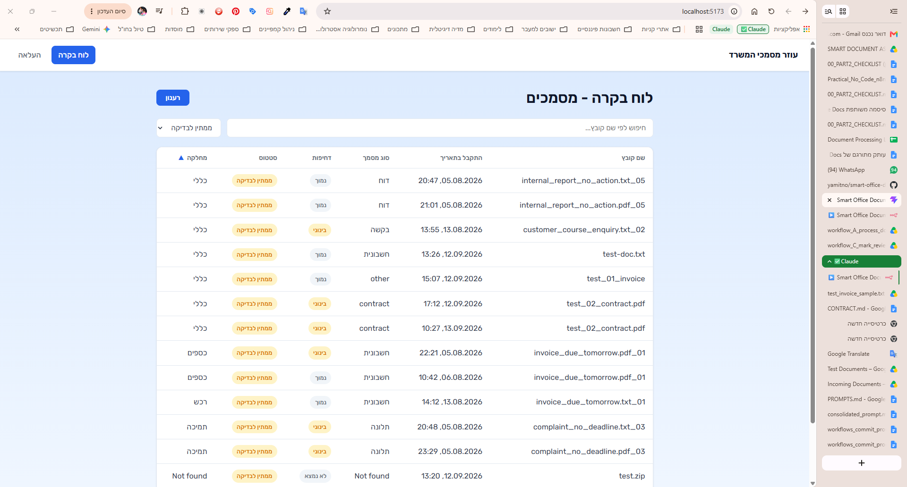
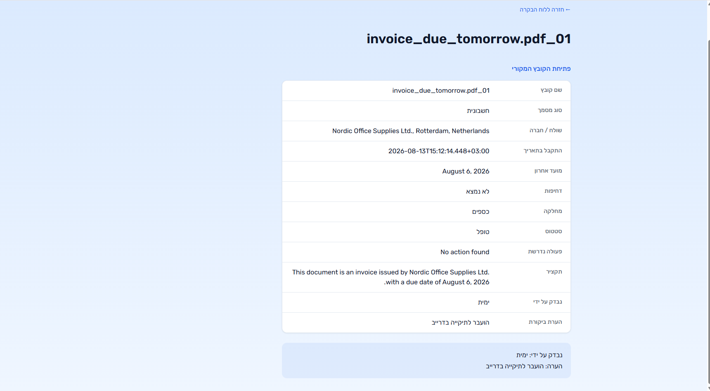
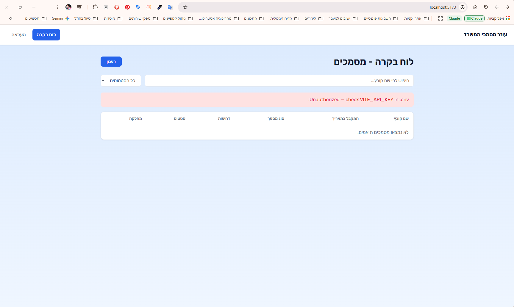
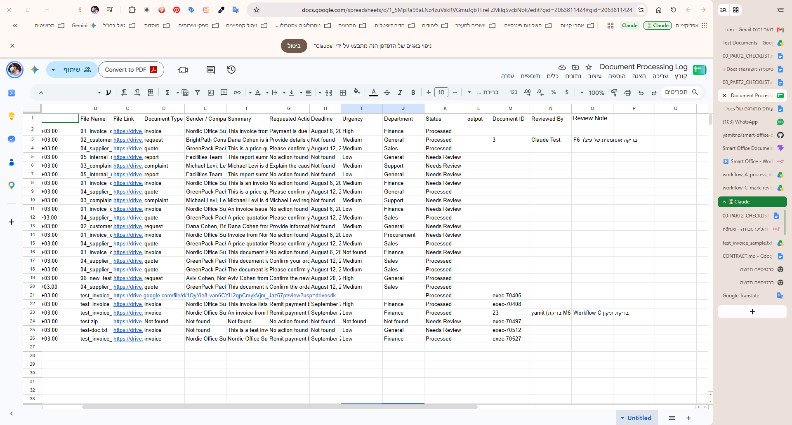
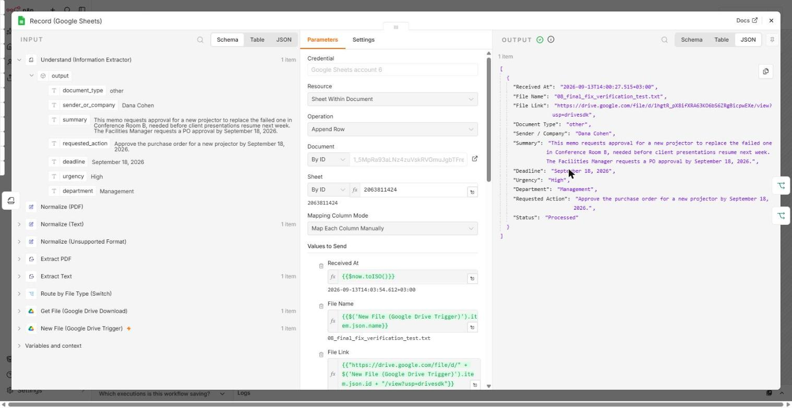
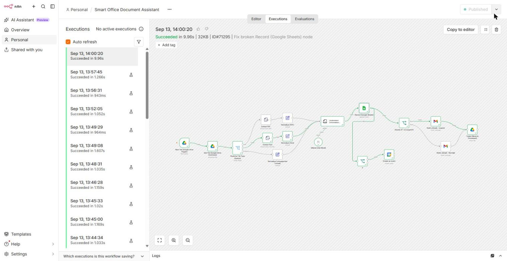
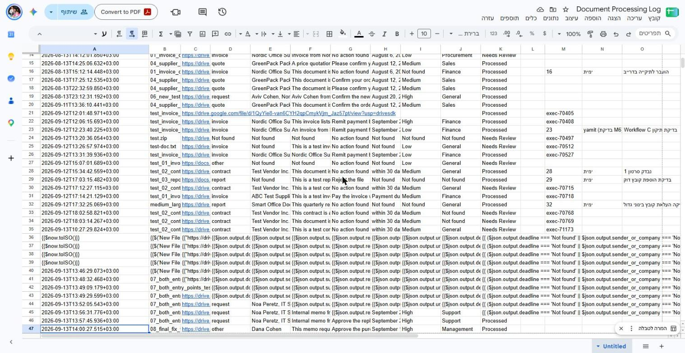

# Smart Office Document Assistant — Part 2: Application Layer

A small React web app that sits in front of an existing n8n automation (Part 1) and turns it into something an office worker can actually use: upload a document, watch it get processed, read the extracted fields, search/filter past documents, and mark one as reviewed — all without ever opening n8n.

**The app never re-implements any business logic.** It does not call an AI model, does not write to Google Sheets, does not send email, and does not decide what "urgent" means. All of that stays exactly where it was in Part 1, inside n8n. The app only collects input, calls n8n's webhooks, and displays whatever n8n returns.

## Architecture

```
┌─────────────┐        HTTPS + x-api-key         ┌───────────────────────────┐
│   Browser    │ ───────────────────────────────▶ │   n8n (3 webhooks)         │
│ React + Vite │ ◀─────────────────────────────── │  A: POST /process-document │
└─────────────┘        JSON (see CONTRACT.md)      │  B: GET  /documents        │
                                                    │  C: POST /review           │
                                                    └─────────────┬─────────────┘
                                                                  │
                                        AI model, Google Sheets, Gmail, Google Drive
                                     (credentials live only inside n8n, never in the
                                              browser or in this repo)
```

- **Workflow A** — `POST /process-document`. Receives a file as base64, extracts its text (PDF / DOCX / TXT), runs it through the AI information extractor from Part 1, uploads the original file to Google Drive, appends a row to the shared "Document Processing Log" Google Sheet, sends a Gmail notification (urgent vs. normal branch), and responds with the extracted fields as JSON.
- **Workflow B** — `GET /documents`. Reads the same Google Sheet and returns all rows as JSON. This is the *only* data source for the dashboard — the app keeps no database of its own.
- **Workflow C** — `POST /review`. Finds the row whose `document_id` matches the request and writes `status`, `Reviewed By`, and `Review Note` back into the sheet.
- **Part 1's original Google Drive trigger keeps running unchanged**, in parallel with the new webhook entry point — a document dropped into the Drive folder and a document uploaded through the app both end up as rows in the same sheet, visible in the same dashboard.

## Features

| # | Feature | Screen |
|---|---|---|
| F1 | Upload screen — drag & drop, file-type and file-size validation before sending | Upload |
| F2 | Processing state — button locked, no double submissions | Upload |
| F3 | Result view — all 7 extracted fields + file link + colored urgency badge | Upload |
| F4 | Dashboard — every processed document, newest first | Dashboard |
| F5 | Search & filters — free text + urgency/type/department/status | Dashboard |
| F6 | Document detail + human review ("Mark as reviewed" with a note) | Document detail |
| F7 | Readable error states for every failure mode (see table below) | all screens |
| F8 | All configuration (URLs, secret, size limit) comes from `.env`, never hardcoded | — |
| F9 | Automatic calendar reminder — a real Google Calendar event is created whenever a processed document has both a real deadline and High/Medium urgency; the dashboard and detail view show whether a reminder was set and link to the event | Dashboard, Document detail |

## Demo video

[`demo/demo_video.mp4`](demo/demo_video.mp4) (4:04) — covers the full flow (upload → result → dashboard/email/sheet → filters → mark as reviewed), plus three failure scenarios: an unsupported file type, an n8n workflow that's been unpublished (server unreachable), and a file that exceeds the size limit alongside one that doesn't.

## Screenshots

| Upload screen | Result view |
|---|---|
|  |  |

| Dashboard with filter applied | Detail view |
|---|---|
|  |  |

| Error state | Updated spreadsheet |
|---|---|
|  |  |

## Part 1 bug fix — evidence

While integrating Part 2, a pre-existing bug was found in Part 1's own n8n workflow (the Google Drive-triggered flow): every field in the "Record (Google Sheets)" node was stuck in **Expression** mode while still containing the literal `{{ }}` wrapper syntax, so instead of evaluating (e.g. `{{$now.toISO()}}`), n8n silently wrote the raw unevaluated text into the sheet. The fix (switching each field to **Fixed** mode and re-entering the same expression) was applied directly to the live, published Part 1 workflow and verified end-to-end with a fresh test file dropped into the Drive folder.

| Node output — all fields now evaluate correctly | Execution succeeded end-to-end |
|---|---|
|  |  |

| Sheet before vs. after the fix (same "Document Processing Log") |
|---|
|  |

This also doubles as evidence for the "both entry points" Required Test (Section 11): the fixed Part 1 Drive trigger keeps appending rows to the exact same sheet the app's Workflow A and Workflow B read from and write to.

## Calendar reminder feature — evidence

Workflow A now creates a real Google Calendar event whenever a processed document has both a real deadline and High/Medium urgency (see `CONTRACT.md` section 2.1 for the full implementation notes and bugs found/fixed along the way). Verified end-to-end with two real webhook calls: a High-urgency invoice with a real deadline produced a real calendar event and `Calendar Reminder = Yes` with a working event link in the sheet, while a Low-urgency document with no deadline produced `Calendar Reminder = No` with no event created — both confirmed via the n8n execution log, the Google Sheet, and the created Google Calendar event's own data.

### Supported file types

`application/pdf`, `text/plain`, and `application/vnd.openxmlformats-officedocument.wordprocessingml.document` (`.docx`).

Anything else — including images and scanned documents — is rejected in the browser, before any request reaches n8n.

### Error handling

| `error_code` | When it happens | What the app shows |
|---|---|---|
| `UNSUPPORTED_FILE_TYPE` | MIME type isn't PDF, DOCX, or TXT | Inline message on the upload screen; nothing is sent |
| (client-side) | File is larger than `VITE_MAX_FILE_MB` | Inline message on the upload screen; nothing is sent |
| `EMPTY_DOCUMENT` | Text extraction found nothing (e.g. a scanned image) | Explains there's no readable text, suggests another file |
| `EXTRACTION_FAILED` | The AI step failed or returned unusable output | "Try again" button; the file stays in the form |
| `UNAUTHORIZED` | Missing or wrong shared secret | A configuration-problem message (not something the end user can fix) |
| (network/n8n down) | The workflow is deactivated or unreachable | A readable "can't reach the server" message; the app stays usable |

## Setup

```bash
git clone <this-repo-url>
cd smart-office-document-assistant
cp .env.example .env       # then fill in the real values below
npm install
npm run dev
```

### `.env` variables

| Variable | Meaning |
|---|---|
| `VITE_API_BASE_URL` | Base n8n webhook URL, e.g. `https://<your-n8n-host>/webhook` |
| `VITE_API_KEY` | The shared secret sent as the `x-api-key` header on every request |
| `VITE_MAX_FILE_MB` | Largest file the upload screen will accept (default `10`) |

## Known limitations

- **The browser calls n8n directly.** Per the assignment's accepted (if lower-scoring) option, there is no small backend server in front of n8n — the shared secret and the webhook URL are visible to anyone who opens the browser's dev tools. This is only acceptable for a classroom demo with a low-value secret; a production version should put a small server (Express/FastAPI) between the browser and n8n so the secret never leaves that server.
- **The app has no database of its own.** The Google Sheet behind Workflow B is the single source of truth for the dashboard. If the sheet is unreachable, the dashboard is empty (not broken — just empty).
- **Node duplication across the three workflows.** Shared processing steps (file extraction, the Google Sheets append, etc.) are duplicated across Workflow A and the original Part 1 flow rather than factored into a sub-workflow. See `Reflection.md` for the maintenance-cost trade-off.

## n8n workflow exports

The four n8n workflows behind this app are exported as JSON in [`workflows/`](workflows/): `workflow-a-process-document.json`, `workflow-b-list-documents.json`, `workflow-c-mark-as-reviewed.json`, and `workflow-part1-drive-trigger.json` (the original Part 1 Google Drive trigger flow). These are workflow exports, not credential exports — no secrets are included, only references to each node's saved n8n credential by id/name. To re-import and run them, you'll need to reconnect the Google Sheets, Google Drive, and Gmail credentials in your own n8n instance and re-point each webhook's "Allowed Origins" / production URL as needed.

## Single run command

```bash
npm run dev
```

That's it — no build step, no database migration, no seed script.
